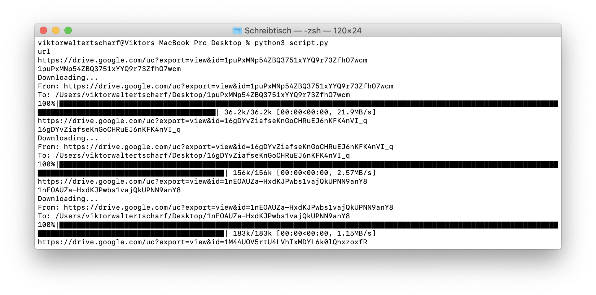

# Python-Download-Google-Drive-Images
Python Download Google Drive Images / Python Bulk Download Google Drive Images

## Setup
```
pip3 install gdown
```
## Getting started

replace all the urls in the urls.csv

## Run
```
cd 
python3 script.py
```
## Preview


